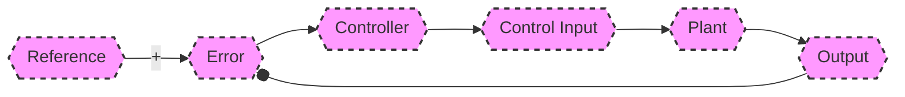

```mermaid
graph LR
    style ReferenceNode fill:#f9f,stroke:#333,stroke-width:2px,stroke-dasharray: 5, 5
    style ErrorNode fill:#f9f,stroke:#333,stroke-width:2px,stroke-dasharray: 5, 5
    style ControllerNode fill:#f9f,stroke:#333,stroke-width:2px,stroke-dasharray: 5, 5
    style ControlInputNode fill:#f9f,stroke:#333,stroke-width:2px,stroke-dasharray: 5, 5
    style PlantNode fill:#f9f,stroke:#333,stroke-width:2px,stroke-dasharray: 5, 5
    style OutputNode fill:#f9f,stroke:#333,stroke-width:2px,stroke-dasharray: 5, 5
    
    ReferenceNode{{Reference}} -->|+| ErrorNode{{Error}}
    ErrorNode --> ControllerNode{{Controller}}
    ControllerNode --> ControlInputNode{{Control Input}}
    ControlInputNode --> PlantNode{{Plant}}
    PlantNode --> OutputNode{{Output}}
    OutputNode --o ErrorNode


```

```